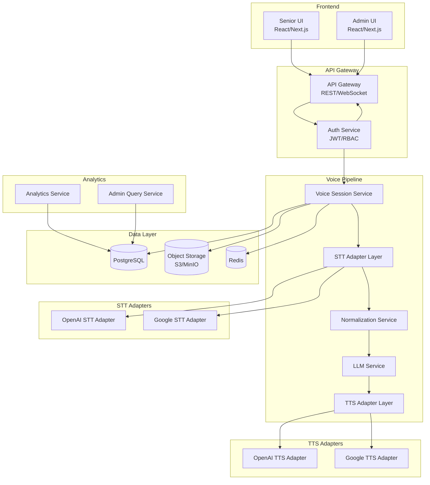
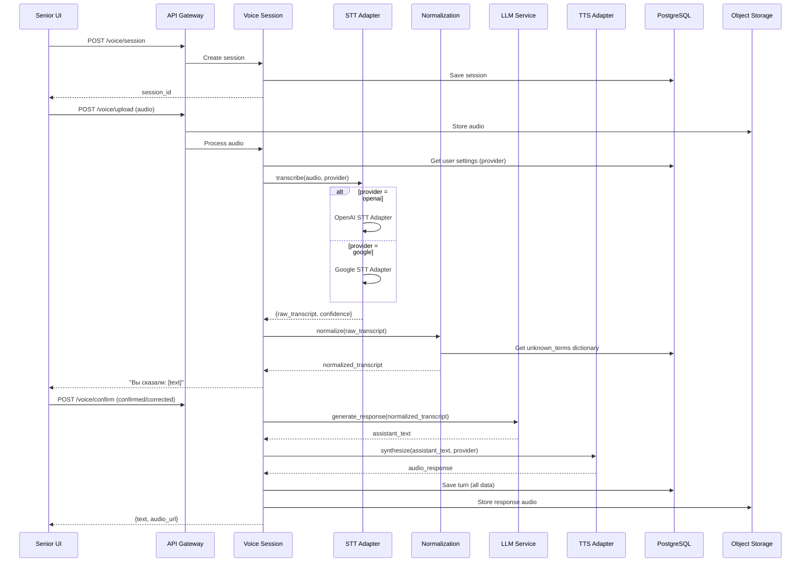
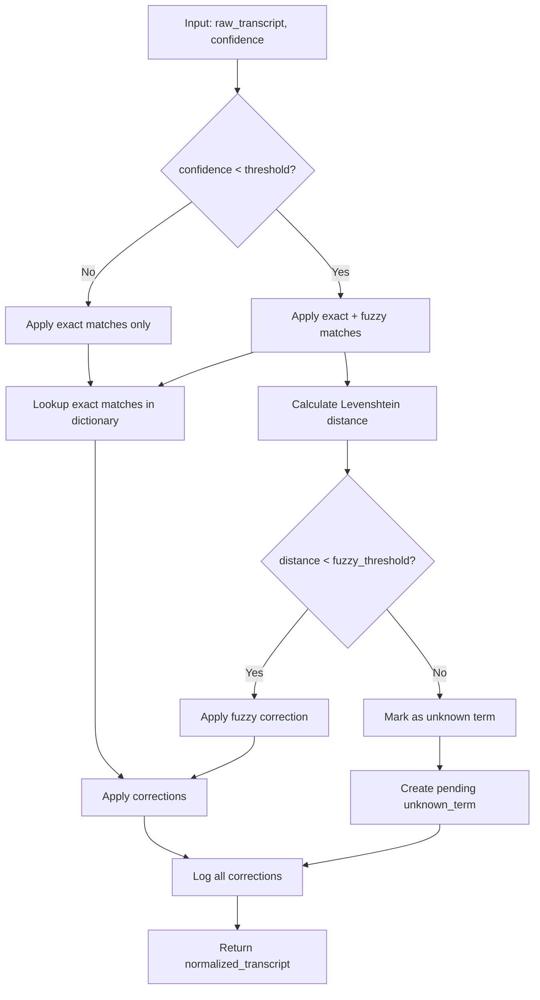

# Design Document: Voice Assistant Pipeline

## Overview

Voice Assistant Pipeline — это система голосового ассистента для пожилых пользователей с поддержкой нескольких STT/TTS провайдеров. Архитектура построена на принципе "Provider per User", где каждый пользователь может использовать разных провайдеров (OpenAI или Google), а все действия логируются для аналитики и улучшения качества распознавания.

### Ключевые принципы:
- **Adapter Pattern** для провайдеров STT/TTS
- **Provider per User** — выбор провайдера в рантайме по настройкам пользователя
- **Normalization Pipeline** — улучшение распознавания через базу "непонятных слов"
- **Full Audit Trail** — логирование всех этапов для аналитики

## Architecture



### Поток обработки голосового запроса



## Components and Interfaces

### 1. STT Adapter Interface

```typescript
interface STTResult {
  text: string;
  confidence: number;
  words?: Array<{
    word: string;
    start: number;
    end: number;
    confidence: number;
  }>;
  language: string;
  latency_ms: number;
}

interface STTAdapter {
  transcribe(
    audio: Buffer | ReadableStream,
    options: {
      language: 'ru' | 'kk';
      hints?: string[];  // подсказки для улучшения распознавания
    }
  ): Promise<STTResult>;
  
  getProviderName(): string;
}
```

### 2. TTS Adapter Interface

```typescript
interface TTSResult {
  audio: Buffer;
  format: 'mp3' | 'wav' | 'ogg';
  duration_ms: number;
  latency_ms: number;
}

interface TTSAdapter {
  synthesize(
    text: string,
    options: {
      language: 'ru' | 'kk';
      voice?: string;
      speed?: number;
    }
  ): Promise<TTSResult>;
  
  getProviderName(): string;
}
```

### 3. Normalization Service Interface

```typescript
interface NormalizationResult {
  raw_transcript: string;
  normalized_transcript: string;
  corrections: Array<{
    original: string;
    corrected: string;
    rule_type: 'exact' | 'fuzzy';
    confidence: number;
  }>;
  unknown_terms_created: string[];
}

interface NormalizationService {
  normalize(
    text: string,
    options: {
      language: 'ru' | 'kk';
      stt_confidence: number;
      context?: string;
    }
  ): Promise<NormalizationResult>;
  
  addTerm(term: UnknownTerm): Promise<void>;
  approveTerm(termId: string): Promise<void>;
  rejectTerm(termId: string): Promise<void>;
}
```

### 4. Voice Session Service Interface

```typescript
interface VoiceSession {
  id: string;
  user_id: string;
  started_at: Date;
  ended_at?: Date;
  provider_stt: 'openai' | 'google';
  provider_tts: 'openai' | 'google';
  turns: Turn[];
}

interface Turn {
  id: string;
  session_id: string;
  timestamp: Date;
  audio_input_url: string;
  raw_transcript: string;
  normalized_transcript: string;
  transcript_confidence: number;
  user_confirmed: boolean;
  user_correction?: string;
  assistant_text: string;
  audio_output_url: string;
  latency_stt_ms: number;
  latency_llm_ms: number;
  latency_tts_ms: number;
}

interface VoiceSessionService {
  createSession(userId: string): Promise<VoiceSession>;
  processAudio(sessionId: string, audio: Buffer): Promise<STTResult>;
  confirmTranscript(sessionId: string, turnId: string, confirmed: boolean, correction?: string): Promise<void>;
  generateResponse(sessionId: string, turnId: string): Promise<{text: string, audioUrl: string}>;
  endSession(sessionId: string): Promise<void>;
}
```

### 5. Admin Query Service Interface

```typescript
interface ConversationFilter {
  user_id?: string;
  provider?: 'openai' | 'google';
  date_from?: Date;
  date_to?: Date;
  low_confidence?: boolean;
  has_corrections?: boolean;
}

interface AnalyticsResult {
  provider: string;
  period: string;
  metrics: {
    total_requests: number;
    avg_confidence: number;
    avg_latency_ms: number;
    correction_rate: number;
    wer?: number;
    cer?: number;
  };
  top_unknown_terms: Array<{term: string, count: number}>;
}

interface AdminQueryService {
  getUsers(filter?: UserFilter): Promise<User[]>;
  updateUserProvider(userId: string, sttProvider: string, ttsProvider: string): Promise<void>;
  getConversations(filter: ConversationFilter): Promise<Conversation[]>;
  getConversationDetails(conversationId: string): Promise<ConversationDetails>;
  getAnalytics(provider?: string, period?: string): Promise<AnalyticsResult>;
  getUnknownTerms(filter?: TermFilter): Promise<UnknownTerm[]>;
}
```

## Data Models

### PostgreSQL Schema

```sql
-- Users
CREATE TABLE users (
    id UUID PRIMARY KEY DEFAULT gen_random_uuid(),
    name VARCHAR(255) NOT NULL,
    role VARCHAR(20) NOT NULL CHECK (role IN ('senior', 'admin')),
    language VARCHAR(5) NOT NULL DEFAULT 'ru' CHECK (language IN ('ru', 'kk')),
    stt_provider VARCHAR(20) NOT NULL DEFAULT 'openai' CHECK (stt_provider IN ('openai', 'google')),
    tts_provider VARCHAR(20) NOT NULL DEFAULT 'openai' CHECK (tts_provider IN ('openai', 'google')),
    is_test_user BOOLEAN DEFAULT FALSE,  -- для дублирования в оба провайдера
    created_at TIMESTAMP WITH TIME ZONE DEFAULT NOW(),
    last_active_at TIMESTAMP WITH TIME ZONE
);

-- Conversations/Sessions
CREATE TABLE conversations (
    id UUID PRIMARY KEY DEFAULT gen_random_uuid(),
    user_id UUID NOT NULL REFERENCES users(id),
    started_at TIMESTAMP WITH TIME ZONE DEFAULT NOW(),
    ended_at TIMESTAMP WITH TIME ZONE,
    stt_provider_used VARCHAR(20) NOT NULL,
    tts_provider_used VARCHAR(20) NOT NULL,
    device_info JSONB
);

-- Turns (каждый шаг диалога)
CREATE TABLE turns (
    id UUID PRIMARY KEY DEFAULT gen_random_uuid(),
    conversation_id UUID NOT NULL REFERENCES conversations(id),
    turn_number INTEGER NOT NULL,
    timestamp TIMESTAMP WITH TIME ZONE DEFAULT NOW(),
    
    -- Input
    audio_input_url VARCHAR(500),
    audio_input_duration_ms INTEGER,
    
    -- STT Result
    raw_transcript TEXT,
    normalized_transcript TEXT,
    transcript_confidence DECIMAL(5,4),
    stt_latency_ms INTEGER,
    stt_words JSONB,  -- [{word, start, end, confidence}]
    
    -- User Confirmation
    user_confirmed BOOLEAN,
    user_correction TEXT,
    
    -- LLM Response
    llm_prompt_summary TEXT,
    assistant_text TEXT,
    llm_latency_ms INTEGER,
    
    -- TTS Response
    audio_output_url VARCHAR(500),
    audio_output_duration_ms INTEGER,
    tts_latency_ms INTEGER,
    
    -- Flags
    needs_review BOOLEAN DEFAULT FALSE,
    low_confidence BOOLEAN DEFAULT FALSE,
    
    UNIQUE(conversation_id, turn_number)
);

-- Unknown Terms Dictionary
CREATE TABLE unknown_terms (
    id UUID PRIMARY KEY DEFAULT gen_random_uuid(),
    language VARCHAR(5) NOT NULL CHECK (language IN ('ru', 'kk')),
    heard_variant VARCHAR(255) NOT NULL,
    correct_form VARCHAR(255) NOT NULL,
    context_examples JSONB DEFAULT '[]',
    provider_where_seen VARCHAR(20),
    occurrence_count INTEGER DEFAULT 1,
    status VARCHAR(20) NOT NULL DEFAULT 'pending' CHECK (status IN ('pending', 'approved', 'rejected')),
    created_at TIMESTAMP WITH TIME ZONE DEFAULT NOW(),
    updated_at TIMESTAMP WITH TIME ZONE DEFAULT NOW(),
    approved_by UUID REFERENCES users(id),
    
    UNIQUE(language, heard_variant)
);

-- STT Evaluation (Ground Truth)
CREATE TABLE stt_evaluations (
    id UUID PRIMARY KEY DEFAULT gen_random_uuid(),
    turn_id UUID NOT NULL REFERENCES turns(id),
    ground_truth_text TEXT NOT NULL,
    labeled_by UUID REFERENCES users(id),
    label_source VARCHAR(20) NOT NULL CHECK (label_source IN ('user_confirm', 'admin_review')),
    wer DECIMAL(5,4),
    cer DECIMAL(5,4),
    created_at TIMESTAMP WITH TIME ZONE DEFAULT NOW()
);

-- Audit Log
CREATE TABLE audit_logs (
    id UUID PRIMARY KEY DEFAULT gen_random_uuid(),
    user_id UUID REFERENCES users(id),
    action VARCHAR(100) NOT NULL,
    resource_type VARCHAR(50) NOT NULL,
    resource_id UUID,
    details JSONB,
    ip_address INET,
    created_at TIMESTAMP WITH TIME ZONE DEFAULT NOW()
);

-- Indexes
CREATE INDEX idx_conversations_user_id ON conversations(user_id);
CREATE INDEX idx_conversations_started_at ON conversations(started_at);
CREATE INDEX idx_turns_conversation_id ON turns(conversation_id);
CREATE INDEX idx_turns_low_confidence ON turns(low_confidence) WHERE low_confidence = TRUE;
CREATE INDEX idx_unknown_terms_status ON unknown_terms(status);
CREATE INDEX idx_unknown_terms_heard ON unknown_terms(heard_variant);
CREATE INDEX idx_audit_logs_user_id ON audit_logs(user_id);
CREATE INDEX idx_audit_logs_created_at ON audit_logs(created_at);
```

### TypeScript Types

```typescript
// User
interface User {
  id: string;
  name: string;
  role: 'senior' | 'admin';
  language: 'ru' | 'kk';
  stt_provider: 'openai' | 'google';
  tts_provider: 'openai' | 'google';
  is_test_user: boolean;
  created_at: Date;
  last_active_at?: Date;
}

// Unknown Term
interface UnknownTerm {
  id: string;
  language: 'ru' | 'kk';
  heard_variant: string;
  correct_form: string;
  context_examples: string[];
  provider_where_seen?: string;
  occurrence_count: number;
  status: 'pending' | 'approved' | 'rejected';
  created_at: Date;
  updated_at: Date;
  approved_by?: string;
}

// Analytics
interface ProviderMetrics {
  provider: string;
  total_requests: number;
  avg_confidence: number;
  avg_stt_latency_ms: number;
  avg_tts_latency_ms: number;
  correction_rate: number;
  wer?: number;
  cer?: number;
}
```

## Normalization Algorithm



### Normalization Rules

1. **Exact Match** (deterministic):
   - Прямое сопоставление heard_variant → correct_form
   - Применяется всегда

2. **Fuzzy Match** (при низком confidence):
   - Расстояние Левенштейна ≤ 2 символа
   - Учитывается язык и частотность
   - Применяется только при confidence < 0.7

3. **Context-Aware** (опционально):
   - Учёт соседних слов для выбора правильного варианта
   - Например: "давление" рядом с "таблетка" → медицинский контекст


## Correctness Properties

*A property is a characteristic or behavior that should hold true across all valid executions of a system — essentially, a formal statement about what the system should do. Properties serve as the bridge between human-readable specifications and machine-verifiable correctness guarantees.*

### Property 1: Provider Selection Correctness

*For any* user with configured stt_provider and tts_provider settings, when processing a voice request, the Voice_Pipeline shall use the STT and TTS adapters that match the user's settings.

**Validates: Requirements 3.4, 3.5, 3.6**

### Property 2: Normalization Dictionary Application

*For any* raw_transcript containing words that exist in the approved Unknown_Terms_Dictionary, the Normalization_Service shall replace those words with their correct_form, and the normalized_transcript shall contain the corrected versions.

**Validates: Requirements 4.1, 8.3**

### Property 3: Fuzzy Matching Activation

*For any* raw_transcript with confidence below the configured threshold, the Normalization_Service shall apply fuzzy matching (Levenshtein distance) in addition to exact matches.

**Validates: Requirements 4.2**

### Property 4: Transcript Preservation Invariant

*For any* normalization operation, the Normalization_Service shall preserve both raw_transcript and normalized_transcript as separate values, regardless of whether corrections were applied.

**Validates: Requirements 4.3, 5.2**

### Property 5: Unknown Term Creation

*For any* word in raw_transcript that is not found in the dictionary and has confidence below threshold, the Normalization_Service shall create a new entry in Unknown_Terms_Dictionary with status 'pending'.

**Validates: Requirements 4.5**

### Property 6: User Correction Persistence

*For any* user correction submitted via the confirm endpoint, the Voice_Pipeline shall:
1. Save the correction to Unknown_Terms_Dictionary
2. Mark the turn as user_corrected = true

**Validates: Requirements 2.6, 5.5**

### Property 7: Data Persistence Completeness

*For any* completed voice turn, the Voice_Pipeline shall persist:
- audio_input_url (in Object Storage)
- raw_transcript, normalized_transcript, confidence, latency
- assistant_text, audio_output_url
- Valid conversation_id and turn_id references

**Validates: Requirements 5.1, 5.2, 5.3, 5.4**

### Property 8: Conversation Filter Correctness

*For any* conversation filter query with specified criteria (user_id, provider, date_range, low_confidence), all returned conversations shall match ALL specified filter criteria.

**Validates: Requirements 7.1, 7.4**

### Property 9: Term Approval Workflow

*For any* unknown term that is approved by an administrator:
1. The term status shall change to 'approved'
2. Subsequent normalization operations shall use this term for corrections

*For any* unknown term that is rejected:
1. The term status shall change to 'rejected'
2. The term shall NOT be used for normalization

**Validates: Requirements 8.3, 8.4**

### Property 10: WER/CER Calculation Correctness

*For any* turn with ground_truth_text (from user confirmation or admin review), the calculated WER shall equal:
`(substitutions + insertions + deletions) / total_words_in_ground_truth`

And CER shall equal:
`(char_substitutions + char_insertions + char_deletions) / total_chars_in_ground_truth`

**Validates: Requirements 9.5**

### Property 11: Top-N Unknown Terms Ordering

*For any* request for top-N unknown terms by provider, the returned list shall be ordered by occurrence_count in descending order and limited to N items.

**Validates: Requirements 9.2**

### Property 12: Test User Dual Provider Processing

*For any* voice request from a user with is_test_user = true and duplication mode enabled, the Voice_Pipeline shall send the audio to BOTH OpenAI and Google STT adapters and store both results.

**Validates: Requirements 9.4**

### Property 13: Authorization Enforcement

*For any* API request:
- If the request lacks valid authentication, return 401 Unauthorized
- If the authenticated user lacks required role for the endpoint, return 403 Forbidden
- Admin endpoints shall only be accessible to users with role = 'admin'

**Validates: Requirements 10.3, 10.6**

### Property 14: Signed URL Generation

*For any* audio file stored in Object Storage, the returned URL shall be a signed URL with expiration, not a public URL.

**Validates: Requirements 10.2**

### Property 15: Audit Log Completeness

*For any* admin action (view conversation, approve term, modify user), an audit_log entry shall be created with: user_id, action, resource_type, resource_id, timestamp.

**Validates: Requirements 10.4**

### Property 16: Retention Policy Enforcement

*For any* audio file older than the configured retention period, the Voice_Pipeline shall delete the file from Object Storage (while preserving text data if configured).

**Validates: Requirements 10.5**

### Property 17: API Response Contract

*For any* successful API call:
- POST /voice/session → returns {session_id}
- POST /voice/transcribe → returns {raw_transcript, normalized_transcript, confidence}
- POST /voice/respond → returns {assistant_text, audio_url}
- POST /voice/confirm → returns {success: true}

**Validates: Requirements 11.1, 11.3, 11.4, 11.5**

### Property 18: Adapter Interface Compliance

*For any* STT adapter implementation, the transcribe() method shall return an object containing: text (string), confidence (number 0-1), and latency_ms (number).

*For any* TTS adapter implementation, the synthesize() method shall return an object containing: audio (Buffer), format (string), and duration_ms (number).

**Validates: Requirements 12.1, 12.2**

### Property 19: Unified Log Format

*For any* provider (OpenAI or Google), the logged STT/TTS results shall use the same schema with fields: provider, text, confidence, latency_ms, timestamp.

**Validates: Requirements 12.4**

## Error Handling

### STT Errors

| Error Type | Handling Strategy |
|------------|-------------------|
| Provider timeout | Retry once, then return error with partial result if available |
| Invalid audio format | Return 400 with supported formats list |
| Audio too short (<0.5s) | Return error suggesting minimum duration |
| Audio too long (>60s) | Return error with maximum duration |
| Provider rate limit | Queue request, retry with exponential backoff |
| Low confidence (<0.3) | Flag for review, still return result |

### TTS Errors

| Error Type | Handling Strategy |
|------------|-------------------|
| Text too long | Split into chunks, synthesize separately, concatenate |
| Unsupported language | Return 400 with supported languages |
| Provider unavailable | Fallback to alternative provider if configured |

### Normalization Errors

| Error Type | Handling Strategy |
|------------|-------------------|
| Dictionary unavailable | Skip normalization, return raw_transcript |
| Fuzzy match ambiguous | Log ambiguity, use highest confidence match |

### General API Errors

```typescript
interface APIError {
  code: string;
  message: string;
  details?: Record<string, any>;
  request_id: string;
}

// Error codes
const ErrorCodes = {
  UNAUTHORIZED: 'E001',
  FORBIDDEN: 'E002',
  INVALID_AUDIO: 'E003',
  PROVIDER_ERROR: 'E004',
  SESSION_NOT_FOUND: 'E005',
  RATE_LIMITED: 'E006',
  INTERNAL_ERROR: 'E999',
};
```

## Testing Strategy

### Unit Tests

Unit tests focus on specific examples and edge cases:

1. **STT Adapter Tests**
   - Test each provider adapter with sample audio files
   - Test error handling for invalid inputs
   - Test timeout handling

2. **Normalization Service Tests**
   - Test exact match replacements
   - Test fuzzy matching with various Levenshtein distances
   - Test language-specific rules (RU, KZ)
   - Test empty dictionary scenario

3. **API Endpoint Tests**
   - Test authentication/authorization
   - Test request validation
   - Test response format compliance

### Property-Based Tests

Property-based tests validate universal properties across generated inputs. Each test runs minimum 100 iterations.

**Testing Framework**: fast-check (TypeScript)

| Property | Test Description | Generator Strategy |
|----------|------------------|-------------------|
| Property 2 | Dictionary application | Generate random transcripts with known dictionary terms |
| Property 4 | Transcript preservation | Generate any transcript, verify both versions saved |
| Property 7 | Data completeness | Generate voice turns, verify all fields persisted |
| Property 8 | Filter correctness | Generate conversations + filters, verify results match |
| Property 10 | WER/CER calculation | Generate transcript pairs, verify formula |
| Property 11 | Top-N ordering | Generate terms with counts, verify ordering |
| Property 13 | Authorization | Generate requests with various auth states |
| Property 17 | API contracts | Generate valid requests, verify response schema |
| Property 18 | Adapter compliance | Generate adapter results, verify schema |

### Integration Tests

1. **End-to-End Voice Flow**
   - Record → STT → Normalize → LLM → TTS → Playback
   - Verify all data persisted correctly

2. **Provider Switching**
   - Change user provider, verify next request uses new provider

3. **Admin Workflows**
   - Create user → View conversations → Approve terms → View analytics

### Test Data Strategy

- Use recorded audio samples for STT testing (RU, KZ)
- Use synthetic data for normalization testing
- Use database fixtures for admin panel testing
- Mock external providers in unit tests, use real providers in integration tests
